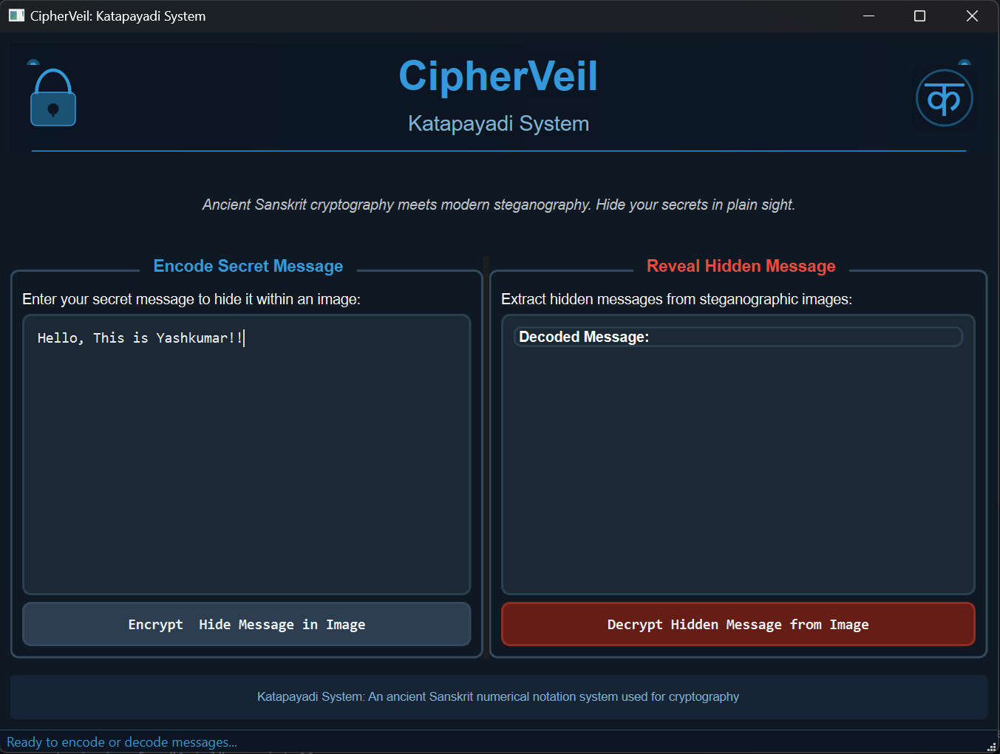

# 🔒 CipherVeil : Katapayadi System 🔒

<p align="center">
  
</p>

<div align="center">
  <strong>Ancient cryptography meets modern steganography</strong><br>
  Hide your secrets in plain sight using the wisdom of Sanskrit
</div>

<br>

<div align="center">
  <a href="#-installation">Installation</a> •
  <a href="#-features">Features</a> •
  <a href="#-usage">Usage</a> •
  <a href="#-gui-application">GUI</a> •
  <a href="#-how-it-works">How It Works</a> •
  <a href="#-contributing">Contributing</a>
</div>

<br>

## 📌 Overview

The **CipherVeil : Katapayadi System** is a sophisticated Python package that seamlessly hides messages within images using Sanskrit characters. It implements a novel encoding method inspired by the ancient **Katapayadi system** - a traditional Sanskrit numerical notation system dating back to ~700 CE. The system first converts English text into Sanskrit characters before embedding them in images using **LSB (Least Significant Bit) steganography**.

## ✨ Features

- 🔠 **Text to Sanskrit Encoding** – Transforms English messages into Sanskrit characters using the Katapayadi system
- 🖼️ **Advanced Image Steganography** – Embeds text within images using LSB encoding for undetectable message hiding
- 🔍 **High Resilience** – Maintains image quality while preserving message integrity
- 🖥️ **Modern GUI** – Features an intuitive PyQt6-based interface with dark mode
- 📜 **Bidirectional Translation** – Extracts hidden Sanskrit-encoded text and converts it back to English
- 🛡️ **Enhanced Security** – Adds an extra layer of security through Sanskrit encoding
- 🐍 **Developer-Friendly API** – Simple, well-documented API for both CLI and GUI applications

## 📥 Installation

### From PyPI (Recommended)

```bash
pip install sanskrit-stegano
```

### From Source (Development)

```bash
git clone https://github.com/YashAPro1/kat_cipher.git
cd kat_cipher
pip install -e .
```

### Dependencies

The system requires the following packages:

```bash
pip install opencv-python numpy pyqt6
```

## 🚀 Usage

### 🛠️ Python API

```python
from sanskrit_stegano import SanskritSteganoSystem

# Initialize the system
system = SanskritSteganoSystem()

# Define your inputs
message = "This message will be hidden using Sanskrit encoding"
image_path = "input.png"  # Your cover image
output_path = "secret_output.png"  # Where to save the steganographic image

# Encoding - Hide your message in an image
system.encode_message_to_image(message, image_path, output_path)
print("✅ Message successfully hidden inside image!")

# Decoding - Extract the hidden message from an image
decoded_message = system.decode_message_from_image(output_path)
print("🔓 Decoded Message:", decoded_message)
```

### 💻 Command Line Interface

```bash
# Encode a message
sanskrit-stegano encode --message "Your secret message" --input input.png --output hidden.png

# Decode a message
sanskrit-stegano decode --input hidden.png
```

### 🖥️ GUI Application

Launch the graphical interface with:

```bash
# If installed via pip
sanskrit-stegano-gui

# If running from source
python -m sanskrit_stegano.gui
```

## 🖼️ GUI Preview

<p align="center">
  
</p>

The graphical user interface provides two main functions:

- **Left Panel**: Encode your secret message in an image
- **Right Panel**: Decode hidden messages from steganographic images

## 🧠 How It Works

1. **Katapayadi Encoding**: The system first converts your message into a series of Sanskrit characters using a modernized version of the ancient Katapayadi numerical encoding system.

2. **Steganographic Embedding**: The Sanskrit-encoded message is then hidden within the least significant bits of the image pixels, making the changes imperceptible to the human eye.

3. **Extraction and Decoding**: To recover the message, the system extracts the modified bits from the image and translates the Sanskrit characters back to the original text.

## 🔒 Security Considerations

While this system provides an excellent way to hide messages, please note:

- It's designed for educational purposes and light security needs
- For critical security applications, consider combining with encryption
- The strength lies in the dual-layer obscurity (steganography + Sanskrit encoding)

## 📋 Requirements

- Python 3.8+
- OpenCV
- NumPy
- PyQt6 (for GUI)

## 📚 Documentation

For detailed API documentation and examples, please visit our [Documentation Page](https://github.com/YashAPro1/kat_cipher/wiki).

## 🛠️ Development Setup

For developers who want to contribute:

```bash
# Clone the repository
git clone https://github.com/YashAPro1/kat_cipher.git

# Setup development environment
cd kat_cipher
pip install -e ".[dev]"

# Run tests
pytest
```

## 🙌 Contributing

Contributions are welcome! Here's how you can help:

1. Fork the repository
2. Create a feature branch (`git checkout -b feature/amazing-feature`)
3. Commit your changes (`git commit -m 'Add some amazing feature'`)
4. Push to the branch (`git push origin feature/amazing-feature`)
5. Open a Pull Request

Please ensure your code follows our coding standards and includes appropriate tests.

## 📜 License

This project is licensed under the MIT License - see the [LICENSE](LICENSE) file for details.

## 💡 Inspiration

This project draws inspiration from:

- The ancient Katapayadi system of Sanskrit numerical notation
- Modern steganography techniques
- The rich cryptographic heritage of ancient India

## 📧 Contact

For questions, support or collaboration:

- **Developer**: Yash Dubey
- **Email**: your.email@example.com
- **GitHub**: [https://github.com/YashAPro1/kat_cipher](https://github.com/YashAPro1/kat_cipher)

---

<div align="center">
  <sub>Built with ❤️ using ancient wisdom and modern code</sub>
</div>
